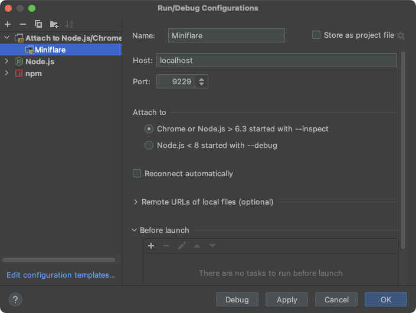

# 🐛 Attaching a Debugger

You can use regular Node.js tools to debug your workers. Setting breakpoints,
watching values and inspecting the call stack are all examples of things you can
do with a debugger.

If you're building your worker beforehand (e.g. with esbuild, Webpack, Rollup),
make sure you're outputting
[🗺 Source Maps](/developing/source-maps#outputting-source-maps) before
proceeding.

## Visual Studio Code

### Create configuration

The easiest way to debug a Worker in VSCode is to create a new configuration.

Open the **Run and Debug** menu in the VSCode activity bar and create a
`.vscode/launch.json` file that contains the following:

```json
---
filename: .vscode/launch.json
---
{
  "configurations": [
    {
      "name": "Miniflare",
      "type": "node",
      "request": "attach",
      "port": 9229,
      "cwd": "/",
      "resolveSourceMapLocations": null,
      "attachExistingChildren": false,
      "autoAttachChildProcesses": false,
    }
  ]
}
```

From the **Run and Debug** menu in the activity bar, select the `Miniflare`
configuration, and click the green play button to start debugging.

## WebStorm

Create a new configuration, by clicking **Add Configuration** in the top right.


Click the **plus** button in the top left of the popup and create a new
**Node.js/Chrome** configuration. Set the **Host** field to `localhost` and the
**Port** field to `9229`. Then click **OK**.



With the new configuration selected, click the green debug button to start
debugging.


## DevTools

Breakpoints can also be added via the Workers DevTools. For more information,
[read the guide](https://developers.cloudflare.com/workers/observability/local-development-and-testing/#devtools)
in the Cloudflare Workers docs.
